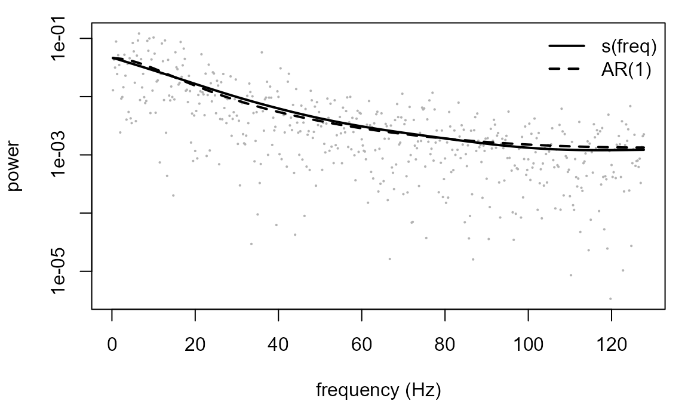

# Spectral models: fitting a periodogram

frmtmb has no spectral estimator and needs none. A periodogram ordinate
of a stationary Gaussian series is exponential about the spectral
density, and
[`exponential()`](https://aforren1.github.io/frmtmb/reference/frmtmb-families.md)
here is mean-parameterized with a log link, so **a spectral model is an
ordinary [`frm()`](https://aforren1.github.io/frmtmb/reference/frm.md)
fit whose response is the periodogram and whose linear predictor is the
log spectrum**. That is the Whittle likelihood, and everything the
package already does - smooths, random effects, nonlinear parameters,
distributional terms - applies to it unchanged.

This page fits four models with that one idea: a parametric spectrum, a
nonparametric one, a hierarchical one, and a peak. It ends with where
the likelihood is safe and where it is not, measured rather than
asserted.

Read
[`vignette("frmtmb")`](https://aforren1.github.io/frmtmb/articles/frmtmb.md)
first for the grammar.

## The data preparation is the part to get right

``` r

y <- as.numeric(arima.sim(list(ar = 0.7), 1024))
pg <- frm_periodogram(y, fs = 256)
head(pg, 3)
#>   freq      pgram
#> 1 0.25 0.01286719
#> 2 0.50 0.04331605
#> 3 0.75 0.03156247
nrow(pg)
#> [1] 511
```

1024 points give 511 rows, not 512 and not 1024.
[`frm_periodogram()`](https://aforren1.github.io/frmtmb/reference/frm_periodogram.md)
drops the zero frequency and the Nyquist frequency, whose ordinates are
chi-square with **one** degree of freedom rather than two and so are not
exponential. Keeping them is wrong in a way that nothing downstream
reports.

The scaling is that of
[`stats::spec.pgram()`](https://rdrr.io/r/stats/spec.pgram.html): `freq`
is in Hz and `pgram` is a density per Hz, so the ordinates average to
the variance divided by the sampling rate.

`taper` is the other argument that changes an answer rather than a
convention. If the spectrum being fitted is steep - an aperiodic
exponent of 2 or more - read “A steep spectrum needs a taper” below
before trusting any number from an untapered periodogram.

``` r

c(mean(pg$pgram), var(y) / 256)
#> [1] 0.007784171 0.007777444
```

## A parametric spectrum

The AR(1) spectral density is `s2 / |1 - phi e^{-i w}|^2`. On the log
scale that is a nonlinear formula in two parameters, and the log link
means the formula IS the log spectrum:

``` r

pg$w <- 2 * pi * pg$freq / 256          # angular frequency
fit_ar <- frm(bf(pgram ~ ls - log(1 - 2 * tanh(z) * cos(w) + tanh(z)^2),
                 ls ~ 1, z ~ 1, nl = TRUE),
              family = whittle(), data = pg)
c(phi = tanh(fixef(fit_ar)[["z"]][[1]]),
  sigma2 = exp(fixef(fit_ar)[["ls"]][[1]]) * 256)
#>       phi    sigma2 
#> 0.7078518 0.9981966
```

The `tanh` is not decoration. A spectrum cannot tell `phi` from
`1 / phi`: the two give the same shape up to a constant, to the last
bit, so the likelihood has two maxima and an unconstrained optimizer
reaches whichever it walks toward. Written as `ph ~ 1` and fitted to a
strongly correlated series, this model returns 1.129 as readily as
0.886, and 1.129 is 1 / 0.886. Constrain the parameter and the ambiguity
is gone.

Against exact Gaussian maximum likelihood on the series itself:

``` r

ref <- arima(y, order = c(1, 0, 0), method = "ML")
c(arima_phi = unname(ref$coef[["ar1"]]), arima_sigma2 = ref$sigma2)
#>    arima_phi arima_sigma2 
#>    0.7056956    0.9970957
```

[`whittle()`](https://aforren1.github.io/frmtmb/reference/whittle.md) is
the family that names this assumption. At its default it is
`exponential(link = "log")`; at `tapers = k` it is Gamma with the shape
held at `k`, for a periodogram that averaged `k` of them.

## A nonparametric spectrum

Nothing about the response changed, so the spectrum can be a smooth
instead, with the smoothing parameter estimated by the same Laplace
marginal likelihood that estimates a random effect’s variance:

``` r

fit_s <- frm(bf(pgram ~ s(freq, k = 20)), family = whittle(), data = pg)
```



The smooth costs precision where the parametric model is right, which is
the usual trade and is visible in the fit: use it when the shape is the
question, not when a parameter is.

## A hierarchical spectrum

This is the reason to do any of it. The aperiodic part of a neural
spectrum is a power law, `S(f) = 10^b f^-chi`, and on the log scale that
is **linear** in `log f`. So a per-subject aperiodic exponent is a
random slope, and the whole two-stage pipeline - fit each spectrum,
extract a number, test the numbers - collapses into one fit.

``` r

fs <- 256
nf <- 511
f_hz <- seq_len(nf) * fs / (2 * nf + 1)
# a series with a given spectrum, built the way frm_series_draw() builds
# one: odd length, so no Nyquist ordinate has to be invented, and
# exactly zero mean
synth <- function(spec, fs) {
  m <- 2 * length(spec) + 1
  amp <- sqrt(m * fs * spec / 2)
  z <- complex(real = rnorm(length(spec), 0, amp),
               imaginary = rnorm(length(spec), 0, amp))
  Re(fft(c(0 + 0i, z, Conj(rev(z))), inverse = TRUE)) / m
}

n_sub <- 12
chi_true <- 1.4 + rnorm(n_sub, 0, 0.3)
Y <- vapply(chi_true, function(ch) synth(10 * f_hz^(-ch), fs), numeric(1023))
colnames(Y) <- sprintf("s%02d", seq_len(n_sub))
pgs <- frm_periodogram(Y, fs = fs)
pgs$logf <- log(pgs$freq)
names(pgs)[names(pgs) == "series"] <- "id"

fit_h <- frm(bf(pgram ~ logf + (1 + logf | id)), family = whittle(),
             data = pgs)
fixef(fit_h)
#> $mu
#> (Intercept)        logf 
#>    2.267599   -1.292537
```

These series are built ON the Fourier grid, so their periodogram has no
leakage and the exponent comes back clean. A recorded segment is not
periodic, and for a steeper spectrum than this one that matters a great
deal, which is the next section.

The population exponent is minus the `logf` coefficient, and each
subject’s own exponent is that plus their random slope, shrunk:

``` r

chi_hat <- -(fixef(fit_h)[["mu"]][["logf"]] + ranef(fit_h)$id[, "logf"])
c(cor = cor(chi_hat, chi_true), max_error = max(abs(chi_hat - chi_true)))
#>        cor  max_error 
#> 0.99740112 0.03292811
```

A covariate on the exponent is now an ordinary interaction,
`logf * age`, and its standard error comes from the same fit as the
exponent rather than from a second-stage regression that treats each
subject’s estimate as if it had no uncertainty.

## A steep spectrum needs a taper

The exponents above were near 1.4, and those series were built ON the
Fourier grid, so nothing leaked. A recorded segment is not periodic, and
an aperiodic exponent of 2 to 3 is ordinary in a neural spectrum. Cut a
segment out of a long series with exponent 3 and ask for the exponent
back:

``` r

nf_long <- 4088
f_long <- seq_len(nf_long) * fs / (2 * nf_long + 1)
steep <- synth(10 * f_long^(-3), fs)[1:1023]      # exponent 3, then CUT

exponent <- function(taper) {
  d <- frm_periodogram(steep, fs = fs, taper = taper)
  d$logf <- log(d$freq)
  -fixef(frm(bf(pgram ~ logf), family = whittle(), data = d))[["mu"]][[2]]
}
exponent("none")
#> Error:
#> ! whittle(tapers = 1): the response is far too smooth to be that. var(diff(log(y))) is 0.251, the refusal triggers below 1.64, and ordinates of shape 1 have an expected 3.29 whatever the spectrum is, since only the spectrum's own step-to-step variation adds to it. Two things look like this. (1) The ordinates were already averaged - Welch, Bartlett, multitaper - and this family says they are raw: pass tapers = the number of periodograms that were averaged. (2) They are spectral leakage rather than signal, which is what an untapered periodogram returns for a spectrum falling faster than f^-2, and the estimate from it would be the leakage floor rather than the spectrum: pass taper = "hann" to frm_periodogram(). If the ordinates ALREADY carry a hann taper, that taper correlates neighbouring ordinates and can trip this check on its own: use taper = "split_cosine", which does not
```

[`whittle()`](https://aforren1.github.io/frmtmb/reference/whittle.md)
refuses, and the second half of its message is the reason. An untapered
transform has a leakage floor that falls like `f^-2`. A spectrum steeper
than that disappears underneath it, so what reaches the model is the
floor: not signal, and not independent exponential ordinates either,
which is the fingerprint the family checks for.

A taper removes the floor, and the exponent comes back:

``` r

c(hann = exponent("hann"), truth = 3)
#>     hann    truth 
#> 3.017831 3.000000
```

Had the fit gone through, it would have returned about 2 whatever the
true exponent, and **whatever the length of the series**. Over 300
replicates:

| exponent | n    | raw        | Hann   | split cosine |
|----------|------|------------|--------|--------------|
| 1        | 256  | 0.000      | -0.024 | -0.003       |
| 1        | 1024 | 0.005      | -0.002 | 0.002        |
| 2        | 256  | -0.084     | 0.017  | 0.061        |
| 2        | 1024 | -0.082     | 0.005  | 0.027        |
| 3        | 256  | **-1.033** | 0.087  | 0.331        |
| 3        | 1024 | **-1.094** | 0.029  | 0.148        |

Bias in the estimated exponent (`dev/freq-findings.md`). A longer
recording makes the untapered estimate worse, not better: -1.03 at n =
256 and -1.09 at n = 1024, against 0.087 and 0.029 for Hann.

**Taper whenever the spectrum falls faster than about `f^-2` across the
band being fitted.**

### What the refusal can and cannot see

Do not rely on the refusal to remind you, and know what its numbers are
conditional on. Measured at **1023 ordinates**, it fires on 97% of
untapered replicates at exponent 3 and 81% at 2.5, but only 14% at
exponent 2 - and at exponent 2 the untapered fit still comes back
quietly 4% low, with small standard errors and well-behaved residuals,
because the model is describing the leakage correctly.

Those are properties of the check *at that many ordinates*. Its
statistic needs rows to compare, so it weakens as the response gets
shorter, and its threshold shrinks with the row count to keep false
refusals near zero:

| epoch at 256 Hz | ordinates | exponent-3 leakage caught |
|-----------------|-----------|---------------------------|
| 1 s (n = 256)   | 127       | 92%                       |
| 2 s (n = 512)   | 255       | 93%                       |
| 4 s (n = 1024)  | 511       | 96%                       |
| 8 s (n = 2048)  | 1023      | 99%                       |

Below 24 ordinates it does not run at all, and a `tapers = 2` response
is separable from a raw one only above about 200 ordinates. The refusal
is a backstop for the extreme case, not a test you can lean on.

**If you work in one-second epochs**, which is the demanding case and
what that first row is: taper by default when you are after an aperiodic
exponent. At n = 256 the untapered estimate is wrong by -1.04 at
exponent 3, and the check will still miss it about one time in twelve.
Averaging segments does not rescue this, it spends the very ordinates
the check needs - `segments = 8` on a 256-point epoch leaves 15.
Stacking epochs does help, because rows are what the check is short of:
[`frm_periodogram()`](https://aforren1.github.io/frmtmb/reference/frm_periodogram.md)
takes a matrix or a `group` argument for exactly that, and a
hierarchical fit over stacked epochs is the shape this vignette
recommends anyway.

The price of the taper is that neighbouring ordinates are no longer
close to independent, so its standard errors are optimistic. That is far
smaller than the bias it removes.

## Peaks need an averaged periodogram, and a starting value

A raw periodogram has a coefficient of variation of 1 at every
frequency: too noisy for the shape of a bump to be identified from one
realization. Averaging `k` non-overlapping segments divides that by
`sqrt(k)`, and the average of `k` exponential ordinates is Gamma with
shape `k`, which is what `whittle(tapers = k)` is:

``` r

# a longer record than the section above, because eight segments and a
# 45 Hz band still have to leave enough ordinates for the family to
# check the shape: see "what the refusal can and cannot see" above
set.seed(5)
f_pk <- seq_len(8192) * fs / (2 * 8192 + 1)
S_of <- function(f) 10 * f^(-1.4) + exp(-(f - 10)^2 / (2 * 1.5^2))
pk <- frm_periodogram(synth(S_of(f_pk), fs), fs = fs, segments = 8)
pk <- pk[pk$freq < 45, ]
pk$logf <- log(pk$freq)
nrow(pk)
#> [1] 359
```

`segments = 8` in the constructor and `tapers = 8` in the family are one
decision written twice, and they have to agree. They buy the resolution
with the segment length, so the grid is eight times coarser.

They have to agree, and here the family says so rather than the prose:

``` r

frm(bf(pgram ~ logf), family = whittle(), data = pk)   # tapers forgotten
#> Error:
#> ! whittle(tapers = 1): the response is far too smooth to be that. var(diff(log(y))) is 0.259, the refusal triggers below 1.64, and ordinates of shape 1 have an expected 3.29 whatever the spectrum is, since only the spectrum's own step-to-step variation adds to it. Two things look like this. (1) The ordinates were already averaged - Welch, Bartlett, multitaper - and this family says they are raw: pass tapers = the number of periodograms that were averaged. (2) They are spectral leakage rather than signal, which is what an untapered periodogram returns for a spectrum falling faster than f^-2, and the estimate from it would be the leakage floor rather than the spectrum: pass taper = "hann" to frm_periodogram(). If the ordinates ALREADY carry a hann taper, that taper correlates neighbouring ordinates and can trip this check on its own: use taper = "split_cosine", which does not
```

An alpha peak sits on top of the aperiodic part, so the spectrum is a
sum in power and the linear predictor is the log of that sum. Fit the
aperiodic part alone first and start the full model from it:

``` r

ap <- frm(bf(pgram ~ logf), family = whittle(tapers = 8), data = pk)
st <- c(off_Intercept = fixef(ap)[["mu"]][[1]],
        chi_Intercept = -fixef(ap)[["mu"]][[2]],
        la_Intercept = 0, cf_Intercept = 10, lbw_Intercept = log(2))

peak <- function(cf0) {
  st[["cf_Intercept"]] <- cf0
  frm(bf(pgram ~ log(exp(off - chi * log(freq)) +
                       exp(la - (freq - cf)^2 / (2 * exp(lbw)^2))),
         off ~ 1, chi ~ 1, la ~ 1, cf ~ 1, lbw ~ 1, nl = TRUE),
      family = whittle(tapers = 8), data = pk, start = list(beta = st))
}
fit_pk <- peak(10)
round(c(centre = fixef(fit_pk)[["cf"]][[1]],
        exponent = fixef(fit_pk)[["chi"]][[1]],
        width = exp(fixef(fit_pk)[["lbw"]][[1]]),
        height = exp(fixef(fit_pk)[["la"]][[1]])), 3)
#>   centre exponent    width   height 
#>     9.96     1.40     1.44     1.12
```

Everything is recovered: the peak was at 10 Hz with width 1.5 and height
1, on an exponent of 1.4.

**Now start the centre at 30 Hz instead.** A Gaussian peak whose centre
starts far from the data is flat: its gradient is zero to rounding
everywhere the data lives, so the optimizer has nothing to follow.

``` r

fit_bad <- peak(30)
c(centre = round(fixef(fit_bad)[["cf"]][[1]], 2),
  se = suppressWarnings(sqrt(diag(vcov(fit_bad)))[["cf_(Intercept)"]]),
  logLik = round(as.numeric(logLik(fit_bad)), 1),
  good_logLik = round(as.numeric(logLik(fit_pk)), 1))
#>      centre          se      logLik good_logLik 
#>        27.4         NaN       216.1       412.3
```

The centre wandered off into a band with no peak in it, the standard
error came back undefined - the curvature at that point is not a
maximum - and the log-likelihood is far below the good fit’s. This is
the single thing most likely to go wrong on this page, and it is a
starting-value failure, not a model failure.
[`par_template()`](https://aforren1.github.io/frmtmb/reference/par_template.md)
prints the names to start.

## Where the Whittle likelihood is safe

Whittle treats the ordinates as independent, which is exact only in the
limit, so the estimator is biased in short series.

What follows compares two estimators of the SAME parameter on the SAME
simulated series: the Whittle profile likelihood over phi with the
innovation variance concentrated out, computed on
[`frm_periodogram()`](https://aforren1.github.io/frmtmb/reference/frm_periodogram.md)
output, against `arima(order = c(1, 0, 0), method = "ML")`, which is
exact Gaussian maximum likelihood on the series itself and estimates a
mean as Whittle implicitly does. Lengths 64 to 4096, phi 0 to 0.95, 400
replicates per cell to n = 1024, 200 at 2048, 100 at 4096. The table is
bias in phi; the grid, the code and the Monte Carlo standard errors are
in `dev/freq-findings.md`, and the numbers are not recomputed here:

| n    | phi = 0 | 0.3    | 0.5    | 0.7    | 0.9    | 0.95   |
|------|---------|--------|--------|--------|--------|--------|
| 64   | -0.006  | -0.016 | -0.027 | -0.031 | -0.041 | -0.044 |
| 128  | 0.004   | -0.010 | -0.014 | -0.018 | -0.020 | -0.023 |
| 256  | -0.006  | 0.000  | -0.004 | -0.010 | -0.012 | -0.013 |
| 512  | -0.002  | 0.001  | -0.001 | -0.006 | -0.006 | -0.007 |
| 1024 | -0.003  | -0.001 | -0.001 | -0.003 | -0.002 | -0.002 |
| 2048 | 0.000   | -0.004 | 0.000  | -0.001 | -0.001 | -0.002 |
| 4096 | 0.000   | -0.002 | -0.003 | 0.000  | 0.000  | 0.000  |

Read it as three statements.

- **The bias is downward and it is a small-sample effect, not a Whittle
  effect.** Exact ML on the same series is biased downward too, and more
  so in 40 of these 42 cells: -0.061 against -0.044 at n = 64 and phi =
  0.9. (The two exceptions are at phi = 0.95, for the reason in the
  third point.) Most of what the table shows is the ordinary
  small-sample bias of an autoregressive estimate, which both methods
  pay. Read that as “Whittle costs nothing here”, not as “Whittle beats
  exact ML in general”: this is one model, one reference implementation,
  and a mean estimated on both sides.
- **One or two seconds of EEG is the demanding case.** At 256 Hz that is
  256 to 512 points, where a bias of one to three percent of a parameter
  near 0.9 is worth stating in a paper. By 4096 points there is nothing
  left to correct.
- **At phi = 0.95 it is the REFERENCE that fails, not Whittle that
  wins.** The exact ML of
  [`arima()`](https://rdrr.io/r/stats/arima.html) drifts up toward the
  unit-root boundary there: median 0.978 at n = 1024 and 0.990 at n =
  4096, against a Whittle median of 0.949 and 0.950 on the same series.
  The positive numbers in the last column of the exact-ML block, and the
  whole root-mean-square advantage Whittle appears to have in that
  column, are the reference optimizer near the boundary. That column is
  not evidence about the two likelihoods.

### Tapering does not always pay

A taper changes the bias but not the family: dividing by `sum(h^2)`
keeps `E I(f)` at the spectral density, so the mean model is untouched
and only the independence between rows is weakened further.

For an AR(1) it costs rather than pays. Hann tapering made the bias
WORSE at every cell of the grid above (-0.062 against -0.044 at n = 64,
phi = 0.9), because that spectrum is not steep enough for leakage to be
the problem and the taper throws away the ends of the series.

So the rule is about the SHAPE of the spectrum, not the length of the
series: taper when it falls faster than about `f^-2` across the band,
which is the aperiodic case shown earlier, and not otherwise.

### The debiased variant, and what it would cost

Replacing the spectral density with the EXPECTED periodogram - the
model’s autocovariance, triangle-weighted and transformed - removes
about a third of the remaining bias (-0.037 against -0.044 at n = 64,
phi = 0.95; -0.031 against -0.041 at phi = 0.9). It is **not**
expressible in this grammar. The mean at one frequency is a sum over
lags of a parameter-dependent autocovariance, so it is not a function of
that row’s predictors, and writing it would need a term whose value at
each row is a linear functional of a vector computed once per likelihood
evaluation. That is the same seam a complex cross-spectrum needs, and it
belongs with that work rather than here.

## What the post-processing is about

Everything after the fit speaks about the **periodogram**, because that
is what was fitted.

``` r

head(fitted(fit_s), 3)      # the fitted spectral density, per Hz
#>          1          2          3 
#> 0.04639334 0.04581062 0.04523522
head(residuals(fit_s), 3)   # ordinate minus that density
#>            1            2            3 
#> -0.033526146 -0.002494575 -0.013672748
```

[`simulate()`](https://rdrr.io/r/stats/simulate.html) is refused by name
on a
[`whittle()`](https://aforren1.github.io/frmtmb/reference/whittle.md)
fit, and so are the four entry points built on it:
[`pp_check()`](https://aforren1.github.io/frmtmb/reference/pp_check.md),
[`frm_simulate()`](https://aforren1.github.io/frmtmb/reference/frm_simulate.md),
[`frm_bootstrap()`](https://aforren1.github.io/frmtmb/reference/frm_bootstrap.md)
and `conditional_effects(method = "predict")`. A draw from this model is
a vector of spectral ordinates, and handed back under the response’s
name it reads as a simulated time series, which it is not: the phases
are not in a periodogram. Draw ordinates in the open instead -

``` r

sim_ord <- rexp(nobs(fit_s), 1 / fitted(fit_s))
```

- and when a series really is what is wanted, ask for one:

``` r

z <- frm_series_draw(fit_s, nsim = 1, seed = 1)
c(length = length(z), fs = frequency(z))
#>  length      fs 
#> 1023.00  255.75
```

[`frm_series_draw()`](https://aforren1.github.io/frmtmb/reference/frm_series_draw.md)
gives each Fourier frequency an independent complex Gaussian amplitude
with the fitted variance and transforms back. It is a draw from the
fitted model, not an inverse of any particular periodogram: two calls
give two unrelated series.

## What this does not do

- **Phase-amplitude coupling** is a higher-order property. It lives in
  the bispectrum, which is not a periodogram and has no exponential
  marginal, so no formula written here reaches it.
- **A non-stationary epoch** breaks the assumption before the likelihood
  is reached. Time-frequency analysis needs segmentation, and each
  segment is then a spectrum of its own; a single fit over a
  non-stationary epoch estimates an average that may describe no moment
  of it.
- **Two signals** need the cross-spectrum, which is complex, and the
  multivariate periodogram at each frequency is complex Wishart rather
  than exponential. Coherence, phase and directed measures are a
  different family, not a different formula, and they are out of scope
  for core.
