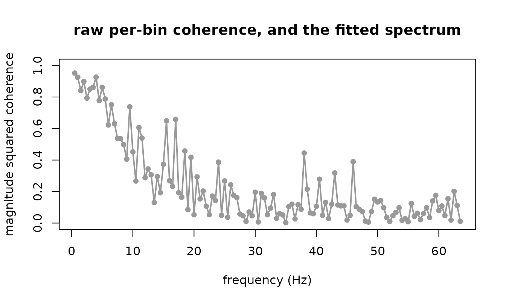

# Coherence without the two-stage pipeline

Two signals are recorded from each of forty people. You want to know how
strongly they are coupled, at which frequencies, and whether the
coupling differs between two groups.

The usual answer is a two-stage pipeline: estimate each person’s
coherence, then test the estimates. This article shows what that costs,
on data whose truth is known, and what one hierarchical fit gives
instead.

## Why the usual answer is wrong

Coherence from `n` segments is biased upward by roughly `(1 - C)^2 / n`.
At a true coherence of zero the estimate has mean exactly `1/n`, so a
person with 4 segments reads 0.25 when the truth is nothing at all.

Two things are usually done about it, and both fail.

**Averaging over people does not help.** The mean of forty biased
numbers carries the same bias, because the bias is in each number rather
than in the spread.

``` r

one_unit <- function(n, coh, phase, la = 0, lb = 0) {
  a <- exp(la); b <- exp(lb); cm <- b * sqrt(coh / (1 - coh))
  z1 <- complex(real = rnorm(n, 0, sqrt(0.5)), imaginary = rnorm(n, 0, sqrt(0.5)))
  z2 <- complex(real = rnorm(n, 0, sqrt(0.5)), imaginary = rnorm(n, 0, sqrt(0.5)))
  d1 <- a * z1
  d2 <- cm * complex(modulus = 1, argument = -phase) * z1 + b * z2
  cr <- sum(d1 * Conj(d2))
  c(w11 = sum(Mod(d1)^2), w22 = sum(Mod(d2)^2),
    w12r = Re(cr), w12i = Im(cr), n = n)
}
naive_mean <- function(N, n, coh) {
  m <- t(replicate(N, one_unit(n, coh, 0.5)))
  mean((m[, "w12r"]^2 + m[, "w12i"]^2) / (m[, "w11"] * m[, "w22"]))
}
round(sapply(c(2, 4, 8, 16, 32), function(n) naive_mean(400, n, 0.2)), 3)
#> [1] 0.572 0.393 0.277 0.244 0.229
```

The truth is 0.2 in every one of those. Four segments reads about 0.39.

**Concatenating everyone’s segments is worse.** Pooling is valid only if
every person has the same spectral matrix. Once phase varies between
people, the cross terms cancel:

``` r

N <- 40; n <- 8
u <- t(replicate(N, one_unit(n, 0.5, rnorm(1, 0.8, 0.8))))
pooled <- (sum(u[, "w12r"])^2 + sum(u[, "w12i"])^2) /
  (sum(u[, "w11"]) * sum(u[, "w22"]))
c(truth = 0.5, naive_mean = mean((u[, "w12r"]^2 + u[, "w12i"]^2) /
                                   (u[, "w11"] * u[, "w22"])),
  pooled = pooled)
#>      truth naive_mean     pooled 
#>  0.5000000  0.5668223  0.2977686
```

Pooling reads far below the truth, and unlike the naive bias it does not
shrink with more segments, because it is cancellation rather than
variance.

### Where this package does not help

The bias is roughly `(1 - C)^2 / n`, so it vanishes as the coupling gets
strong. Here is the naive bias at 4 segments across three true
coherences:

``` r

round(sapply(c(0.2, 0.5, 0.9), function(C) naive_mean(2000, 4, C)) -
        c(0.2, 0.5, 0.9), 3)
#> [1] 0.175 0.085 0.004
```

At a true coherence of 0.9 the bias is a few thousandths against 0.175
at 0.2. **There is nothing to correct up there, and this package buys
you nothing for it.**

The whole argument lives at low to moderate coherence, which is also
where most real cortico-muscular and cortico-cortical couplings sit. If
your coherences are all above about 0.8, fit whatever is convenient and
report it; the reason to come here is a hierarchical question, an
interval you trust, or a group comparison, not the bias.

## The model

The pair’s periodogram at one frequency is complex Wishart about the
spectral matrix.
[`cross_wishart()`](https://aforren1.github.io/frmtmb/frmtmb.coupling/reference/cross_wishart.md)
is that likelihood, parameterized so its four distributional parameters
are the two channel powers, the coherence and the phase. Each takes a
formula, so a random effect on coherence is written the way any random
effect is written.

``` r

xs <- as.data.frame(t(replicate(N, one_unit(n, 0.5, rnorm(1, 0.8, 0.8),
                                            la = rnorm(1, 0, 0.3),
                                            lb = rnorm(1, 0, 0.3)))))
xs$id <- factor(seq_len(N))
head(xs, 3)
#>         w11       w22      w12r      w12i n id
#> 1 11.883109  6.461627 0.2445355  6.129594 8  1
#> 2  7.473119 29.736050 5.2062126 12.518727 8  2
#> 3  5.495194  7.463301 2.3805728  3.623912 8  3
```

``` r

fit <- frm(bf(w11 | vreal(w22, w12r, w12i) + vint(n) ~ 1 + (1 | id),
              pow2 ~ 1 + (1 | id),
              coh ~ 1 + (1 | id),
              phase ~ 1 + (1 | id)),
           family = cross_wishart(), data = xs)
frm_coherence(fit, newdata = xs[1, ], re.form = NA)
#>   .estimate       .se    .lower    .upper       .eta
#> 1 0.4695287 0.1226127 0.4103901 0.5295356 -0.1220363
```

The interval is a Wald interval on the logit scale pushed through
[`plogis()`](https://rdrr.io/r/stats/Logistic.html), so it cannot leave
`(0, 1)` however close to a boundary the estimate sits. That boundary is
where the arithmetic has to be careful: `plogis(eta)` is exactly 1 in
double precision above about `eta = 36.7`, so the density never forms
`1 - C` by subtraction. It asks core for `log(1 - C)` with
[`frmtmb::dpar_log1m()`](https://aforren1.github.io/frmtmb/reference/frmtmb-robust-dpars.html),
which reads the linear predictor core keeps beside each parameter and is
exact to `eta = 709`. A draft of this package did subtract, and returned
`NaN` above `eta = 36.7` and a confidence interval of width zero for two
signals that differed only by 1e-5 of noise.

### Put a random effect on every parameter, not only on coherence

The two channel powers are incidental parameters: two free numbers per
person that gain no information as people are added. Left free, they
starve the coherence variance component, which collapses to zero without
a warning; the fit converges and its interval covers 62 percent of the
time instead of 95.

| what carries a random effect | bias at n = 4 | 95% coverage |
|----|----|----|
| coherence and phase only, powers free per person | +0.068 | 0.622 |
| all four parameters | +0.008 | 0.912 |

Measured over 150 replicates, 40 people; `dev/xspec-findings.md` in the
repository has the full table. It is the failure that looks most like
success.

## From signals to rows

[`frm_cross_spectrum()`](https://aforren1.github.io/frmtmb/frmtmb.coupling/reference/frm_cross_spectrum.md)
does the data preparation, including the parts that are easy to get
wrong and impossible to notice: it drops frequency zero and the Nyquist
frequency, whose coefficients are real rather than complex, and it
counts the degrees of freedom honestly.

``` r

sfreq <- 128
src <- as.numeric(filter(rnorm(4096), 0.9, method = "recursive"))
a <- src + rnorm(4096, 0, 0.5)
b <- 0.9 * src + rnorm(4096, 0, 2)
sp <- frm_cross_spectrum(a, b, sfreq = sfreq, segments = 16)
head(sp, 3)
#>   freq       w11       w22      w12r      w12i  n
#> 1  0.5 1678.5668 1453.5994 1522.6362  65.39112 16
#> 2  1.0  927.8641  764.1049  809.0603 -38.48858 16
#> 3  1.5  641.8278  554.8955  547.1008  10.59337 16
```

Segments, sine tapers and frequency smoothing all buy real degrees of
freedom, and all three deliver the nominal count to within 2 percent on
white noise. `tapers` and `smooth` may not both exceed 1: they widen the
same spectral window, so their product is not the count. Four tapers
smoothed over four bins buys 5.8 draws, not 16.

## The one trap

The likelihood couples the powers and the coherence. A power formula too
simple for the spectrum does not merely leave the powers wrong; it
reweights the rows each coherence parameter pools and moves the
coherence with them.

``` r

sp$band <- factor(ifelse(sp$freq < 32, "low", "high"), c("low", "high"))
flat <- frm(bf(w11 | vreal(w22, w12r, w12i) + vint(n) ~ 1,
               pow2 ~ 1, coh ~ band, phase ~ 1),
            family = cross_wishart(), data = sp)
#> Warning: Large maximum absolute gradient at the optimum (0.00116); the fit may
#> not have converged. diagnose() names the offending parameter; see the
#> 'Convergence problems' section of vignette('diagnostics') for the remedies
```

Nothing warned about the thing that matters. The fit may report a large
maximum absolute gradient, which is about the optimizer and not about
this; core raises it on `Gamma(link = "log")` fits of the same response
too, and it is seed dependent. What it does NOT say is that the
coherence you are about to read has been displaced.

There is no automatic check for it, and that is deliberate. A draft of
this package warned from a `fit_check` hook that measured the spread of
the power residuals, and that statistic turned out not to track the
coherence displacement: it stayed silent at a 2.7-fold power spread
where the reported coherence was already nearly double the truth, and it
fired at a ratio of 20.5 on a correctly specified model whose coherences
were right. A check that punishes correct models teaches people to
ignore it, so it was withdrawn.

**Compare AIC instead.** Fit the powers with and without a frequency
term and keep the one AIC prefers:

``` r

good <- frm(bf(w11 | vreal(w22, w12r, w12i) + vint(n) ~ s(freq, k = 8),
               pow2 ~ s(freq, k = 8), coh ~ band, phase ~ 1),
            family = cross_wishart(), data = sp)
nd <- data.frame(band = factor(c("low", "high"), c("low", "high")),
                 freq = c(16, 48))
rbind(flat = frm_coherence(flat, newdata = nd)$.estimate,
      good = frm_coherence(good, newdata = nd)$.estimate)
#>           [,1]       [,2]
#> flat 0.4579340 0.40876097
#> good 0.3591103 0.04314377
c(AIC_flat = AIC(flat), AIC_good = AIC(good), delta = AIC(flat) - AIC(good))
#> AIC_flat AIC_good    delta 
#> 8490.902 4089.772 4401.130
```

The shared source is low-pass, so the low band really is the coherent
one. The flat fit calls the two bands nearly equal; the well specified
one separates them, and AIC prefers it by thousands.

The comparison works where the withdrawn hook did not. On a two-band
design at `n = 8` with true coherences 0.35 and 0.05, varying how much
the power slopes across the record:

| power spread | flat powers report | correct powers report | delta AIC |
|--------------|--------------------|-----------------------|-----------|
| 1.6x         | 0.295, 0.083       | 0.330, 0.068          | 80        |
| 2.7x         | 0.268, 0.078       | 0.342, 0.041          | 487       |
| 7.3x         | 0.240, 0.206       | 0.342, 0.047          | 1849      |
| 19.6x        | 0.229, 0.458       | 0.341, 0.052          | 3716      |
| 385x         | 0.222, 0.875       | 0.342, 0.059          | 11518     |

AIC rejects the flat model by 80 or more even at the mildest spread, and
the correct model recovers 0.35 and 0.05 throughout. **Model the powers
before reading any coherence.**

## A coherence spectrum

Coherence that varies with frequency is a smooth on `coh`. It cannot
leave `(0, 1)` at any point on the smooth, because the logit link is the
positive definiteness constraint rather than a convenience.

``` r

spec <- frm(bf(w11 | vreal(w22, w12r, w12i) + vint(n) ~ s(freq, k = 10),
               pow2 ~ s(freq, k = 10), coh ~ s(freq, k = 10), phase ~ 1),
            family = cross_wishart(), data = sp)
co <- frm_coherence(spec)
range(co$.lower)
#> [1] 0.009043064 0.884928056
range(co$.upper)
#> [1] 0.05689555 0.93557525
```



The grey points are each bin’s own coherence, every one of them biased
upward by about `1/16`; the line is the fitted spectrum, which borrows
strength across frequency and does not have to be.

## Checking the fit

[`simulate()`](https://rdrr.io/r/stats/simulate.html) refuses on this
family, and says why: a draw is a whole Hermitian matrix and the
response slot carries one of its four numbers, so a simulated `w11`
sitting beside the observed rest is not a draw from anything.
[`frm_cross_simulate()`](https://aforren1.github.io/frmtmb/frmtmb.coupling/reference/frm_cross_simulate.md)
returns all four columns.

``` r

rep1 <- frm_cross_simulate(spec, nsim = 1, seed = 3)[[1]]
str(rep1)
#> 'data.frame':    127 obs. of  5 variables:
#>  $ w11 : num  713 549 1267 851 558 ...
#>  $ w22 : num  609 370 1235 737 598 ...
#>  $ w12r: num  621 429 1210 750 539 ...
#>  $ w12i: num  -32.7 36.8 42.9 -21.2 -47.9 ...
#>  $ n   : num  16 16 16 16 16 16 16 16 16 16 ...
all(rep1$w11 * rep1$w22 - rep1$w12r^2 - rep1$w12i^2 > 0)
#> [1] TRUE
```

Every draw is positive definite, so a replicate can be refitted rather
than merely plotted.

## What this does not do

- **More than two channels.** This is a scope decision of this package
  and not a limit of `frmtmb`: core carries a matrix-valued response and
  a custom family reading `y[, 1]` and `y[, 2]` fits today. What stops
  it here is that `p` channels need `p^2` linear predictors written by
  hand, that the clean `power, power, coherence, phase` coordinates do
  not survive past two, and that the log determinant and trace stop
  being closed forms. Fit pairs. Note that a matrix pair passed to
  [`frm_cross_spectrum()`](https://aforren1.github.io/frmtmb/frmtmb.coupling/reference/frm_cross_spectrum.md)
  is many UNITS of one channel pair, never many channels.
- **Non-stationary epochs.** Everything here assumes the spectral matrix
  is constant over the record a segment is cut from. A time-varying
  coupling needs segmentation or a different formulation.
- **Phase-amplitude coupling.** That is a higher-order property and
  needs the bispectrum, which is not this framework.
- **Overlapping segments.** Refused, because overlap raises the nominal
  degrees of freedom without raising the independent ones, and every
  standard error downstream would be too small.
